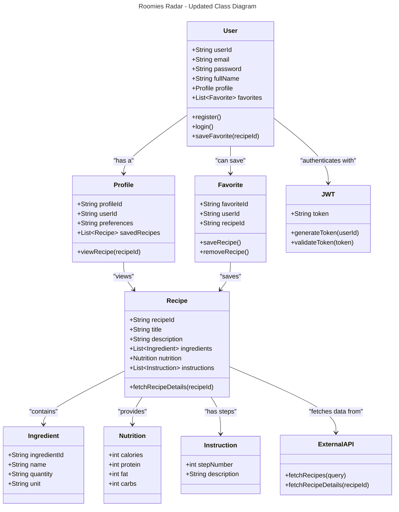

# DishCovery -- Discover the perfect dish

## Overview

- The 'Recipe Finder' application aims to help users discover recipes based on ingredients, cuisine, dietary restrictions, and cooking time.
- It will provide a user-friendly interface for browsing, saving, and sharing recipes. The backend will handle user authentication, recipe storage, and API integration for fetching recipe data.

## Tech Stack
  - Frontend: ReactJS
  - Backend: Node.js (Express)
  - Database: MongoDB (for recipe and user data storage)
  - API Integration: External recipe APIs (e.g., Spoonacular API)
  - Authentication: JWT (JSON Web Token)
  - Deployment: AWS (EC2, S3) or Vercel for frontend

## Core Features
 - User Registration and Login :- Users can sign up and log in to access personalized features.
 - Recipe Search :- Search for recipes by ingredients, cuisine, or dietary preferences.
 - Recipe Details :- View detailed information about each recipe, including ingredients, cooking instructions, and nutritional info.
 - User Profile :- Users can save favorite recipes and create custom recipe collections.
 - API Integration :- Integrate with an external recipe API for extensive recipe data.
 - Responsive Design :- The application will be mobile-friendly.

## High-Level Architecture
      
  - Frontend (ReactJS)
    - Pages: Home, Search, Recipe Details, User Profile, Login, Registration.
    - Components: Navbar, RecipeCard, SearchBar, RecipeDetails, UserProfile.
    - State Management: Context API or Redux (for managing global state).
    - Backend (Node.js, Express)

  - Routes: /api/users, /api/recipes, /api/search.
    - Controllers: UserController, RecipeController.
    - Middleware: Authentication (JWT), Error Handling.
    - Database Models: User, Recipe, Favorite.
    - Database (MongoDB)
    
  - Collections: users, recipes, favorites.

## API Endpoints
- User Registration (/api/users/register)

     - Method: POST
     - Request Body: email, password, fullName
     - Response: 201 Created
     - User Login (/api/users/login)

- Method: POST
  - Request Body: email, password
  - Response: 200 OK with JWT token
  - Search Recipes (/api/recipes/search)

- Method: GET
    - Query Params: ingredients, cuisine, diet
    - Response: List of recipes
    - Get Recipe Details (/api/recipes/{recipeId})

- Method: GET
    - Response: Recipe details
    - Save Favorite Recipe (/api/users/{userId}/favorites)

- Method: POST
    - Request Body: recipeId
    - Response: 201 Created

## Domain Driven Design Diagram

